# Telegnize

[](LICENSE)
[](https://www.python.org/)
[](https://fastapi.tiangolo.com/)
[](https://www.sqlite.org/)
[](https://react.dev/)
[](https://www.typescriptlang.org/)
[](https://vite.dev/)
[](https://pypi.org/project/laya/)

Telegnize imports Telegram chat exports, normalizes Persian and English text,
and reports what the conversation looked like — who carried it, how fast people
answered each other, when they talked — alongside typed decisions from the
[Laya](https://pypi.org/project/laya/) System 1 engine.

Exports are read as a stream, so a multi-gigabyte file imports in the same
memory footprint as a small one.

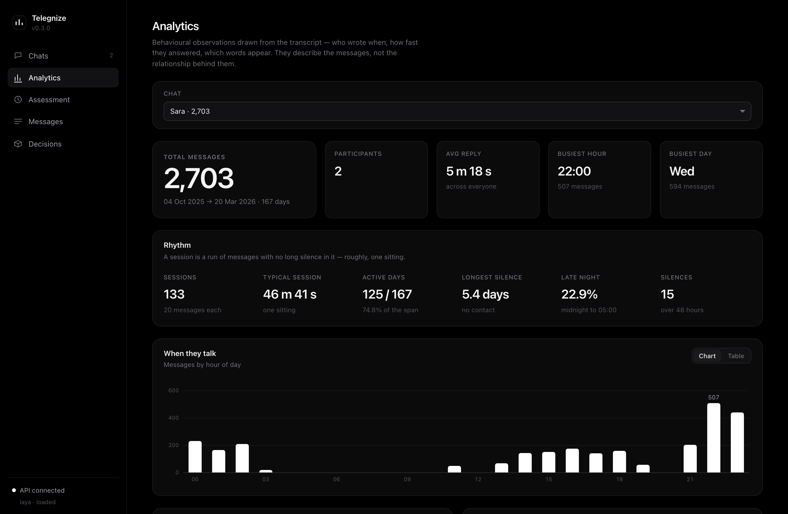

> Every screenshot on this page is a generated demo conversation between two
> invented people. Nothing here is anyone's chat.

## Setup

### Prerequisites

| | |
| --- | --- |
| **Python 3.12+** | with [uv](https://docs.astral.sh/uv/) for dependency management |
| **Node 20+** | only if you want the web interface |
| **~1.5 GB disk** | the Laya checkpoints, downloaded on first use and cached |
| **A Telegram export** | Telegram Desktop → ⋮ → *Export chat history* → format **JSON** |

The decision engine is optional. Import, analytics and the message browser all
work without ever loading a model; only `/api/assessments` and `/api/decisions`
need one.

### 1. Install and run the API

```bash
git clone https://github.com/farnam-jhn/Telegnize.git
cd Telegnize
uv sync
uv run telegnize
```

The API serves on `http://127.0.0.1:8000`, with interactive documentation at
[`/docs`](http://127.0.0.1:8000/docs). It creates `telegnize.sqlite` in the
working directory on first run.

### 2. Import a chat

Either drag the JSON onto the **Chats** tab in the UI, or from the shell:

```bash
curl -X POST localhost:8000/api/chats/import-local \
  -H 'Content-Type: application/json' -d '{"file_path": "result.json"}'
```

A few hundred thousand messages import in a couple of minutes, in constant
memory. The response carries the `chat_id` everything else is keyed on.

### 3. Look at it

```bash
curl localhost:8000/api/analytics/1
```

Analytics is pure arithmetic — it needs no model and returns in seconds even on
a large chat.

### 4. The web interface (optional)

In a second shell:

```bash
npm --prefix frontend install
npm --prefix frontend run dev
```

The UI serves on `http://localhost:3000` and proxies `/api` to port 8000, so no
CORS configuration is needed. Point it elsewhere with
`TELEGNIZE_API=http://host:port npm --prefix frontend run dev`.

### 5. Assessment (optional, slow)

The classified figures run a model over every message. Time one small page on
your own hardware before committing to a long run:

```bash
time curl -X POST "localhost:8000/api/assessments/1?offset=0&limit=5"
```

The first call also loads the checkpoints. Set
`TELEGNIZE_PRELOAD_DECISION_ENGINE=1` to pay that at startup instead.

### Upgrading an older database

Counts and markers are written as messages are stored, so a chat imported
before a metric existed reads as zero for it. They are all functions of text
already in the database, so recompute rather than re-import:

```bash
curl -X POST localhost:8000/api/chats/1/rederive
```

The UI offers the same thing as a button wherever it detects the gap. A voice
note's duration is the one exception — it lives in the export rather than in
the text, so that needs a fresh import.

## Tech stack

**Backend**

[](https://www.python.org/)
[](https://fastapi.tiangolo.com/)
[](https://docs.pydantic.dev/)
[](https://www.uvicorn.org/)
[](https://www.sqlite.org/)

**Text and inference**

[](https://pypi.org/project/laya/)
[](https://pytorch.org/)
[](https://github.com/roshan-research/hazm)
[](https://pypi.org/project/ijson/)

**Frontend**

[](https://react.dev/)
[](https://www.typescriptlang.org/)
[](https://vite.dev/)

**Tooling**

[](https://docs.astral.sh/uv/)
[](https://docs.astral.sh/ruff/)
[](tests/)

| Choice | Why |
| --- | --- |
| **SQLite** | One file, no daemon. Every analytic is an aggregate query, so the database does the work and Python never holds a chat in memory. |
| **ijson** | Exports run to gigabytes; messages are pulled off the file one at a time rather than parsed whole. |
| **hazm** | Persian normalization — ZWNJ and half-space handling, Arabic-to-Persian character harmonisation. |
| **Laya** | Answers a whole typed question set in one non-autoregressive forward pass, and routes between an English and a multilingual checkpoint by script. |
| **No ORM** | The queries are window functions over timestamps. They are clearer as SQL than as anything generating it. |
| **No CSS framework** | Every colour, radius and duration is a custom property in `tokens.css`; components reference roles, never raw hex. |

## Endpoints

| Method | Path | Purpose |
| --- | --- | --- |
| `POST` | `/api/chats/upload` | Import an uploaded export |
| `POST` | `/api/chats/import-local` | Import an export already on the server |
| `GET` | `/api/chats` | List imported chats |
| `GET` `DELETE` | `/api/chats/{id}` | Read or delete one chat |
| `GET` `POST` | `/api/messages` | Query messages, or store one |
| `GET` | `/api/analytics/{chat_id}` | [Behavioural profile](docs/analytics.md) of a chat |
| `POST` `GET` | `/api/decisions/messages/{id}` | Evaluate a message, or read the cache |
| `POST` `GET` | `/api/decisions/chats/{id}` | Evaluate a conversation window |
| `POST` `GET` | `/api/assessments/{chat_id}` | Run a [relational assessment](docs/analytics.md) pass, or read it |
| `POST` | `/api/chats/{chat_id}/rederive` | Recompute derived columns from the text already stored |
| `POST` | `/api/decisions/custom` | Ask arbitrary typed questions |
| `GET` | `/api/health` | Service and dependency status |

## Interface

`frontend/` is a React + TypeScript app built with Vite, and the only consumer
of the API that ships in this repository. It covers the same ground the
endpoints do: importing exports, the behavioural profile of a chat, a message
browser that lays Persian out right-to-left, and typed decisions with the
probability the engine assigned to every alternative.

Counted and classified figures are kept apart the way
[docs/analytics.md](docs/analytics.md) keeps them apart — **Analytics** for what
was counted, **Assessment** for what a model read. The participant tables in
both follow that document's groups, each carrying its caveat, and the
assessment pass is driven one page at a time from the UI so a run is always a
deliberate choice rather than something a button starts by accident.

```bash
npm --prefix frontend run dev        # http://localhost:3000
npm --prefix frontend run build      # static bundle in frontend/dist
npm --prefix frontend run typecheck
```

A production build reads `VITE_API_BASE` for the API origin; leaving it unset
makes the bundle call `/api` on whatever host serves it.

### Chats

Drop an export in, or point the server at a path it can already read.

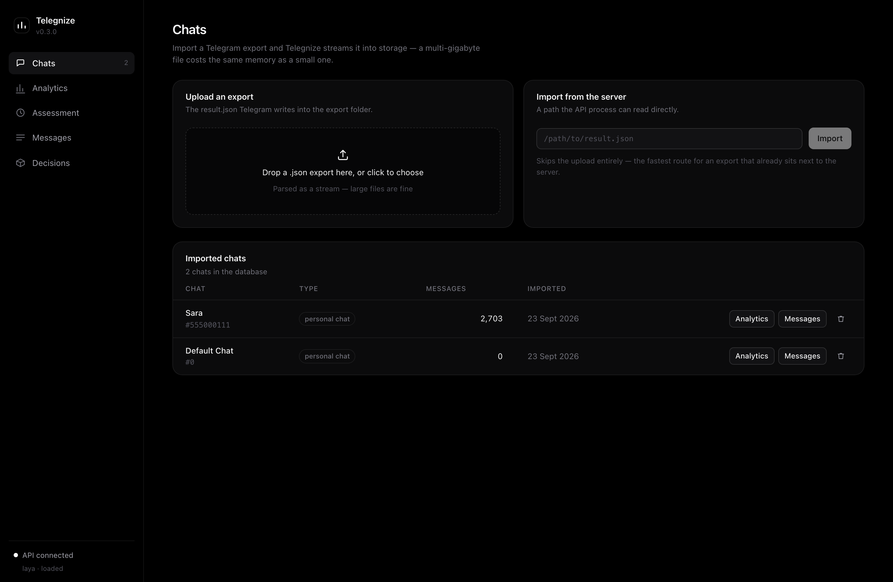

### Analytics

Counted figures only. The participant table carries eight groups; each one
states what it does and does not support above the columns.

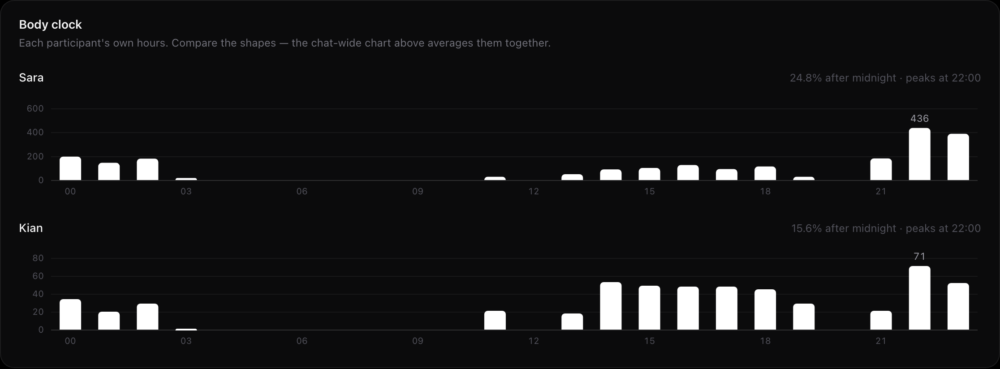

Every participant's own hours, because the chat-wide chart averages two people
together and describes neither of them when they keep different schedules.

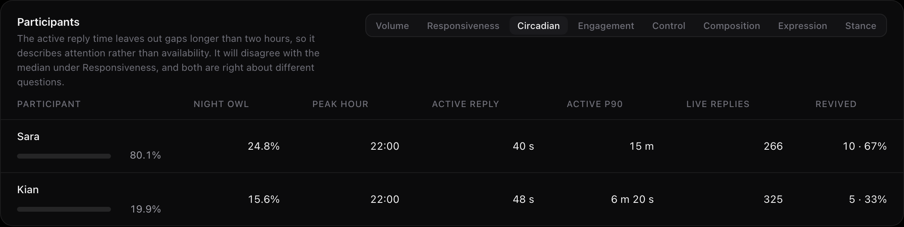

Reply time is reported twice — the ordinary median counts a reply after a
night's sleep, the active one narrows to two hours and is about attention.

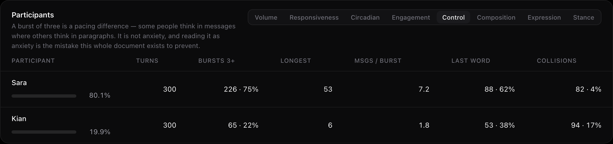

Who sets the pace and who is left holding the last message. A burst of three is
a pacing difference, not a diagnosis.

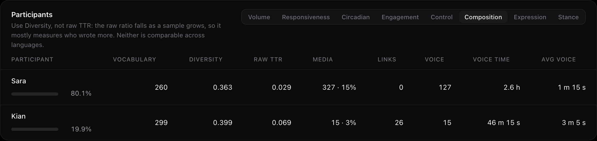

Raw type-token ratio falls as a sample grows, so it mostly measures who wrote
more; the moving-average figure beside it does not, and is the comparable one.

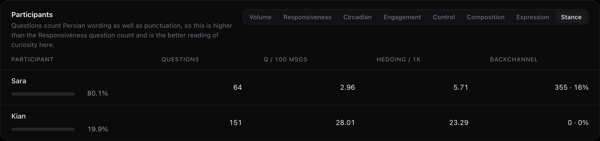

Questions count Persian wording as well as punctuation — Persian questions are
routinely written with no `؟` at all.

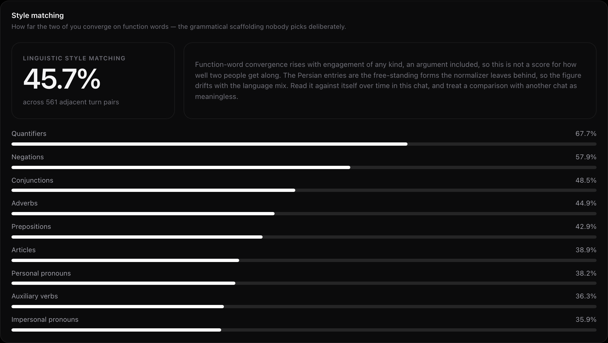

Function-word convergence across adjacent turns, per category. It rises with
engagement of any kind, an argument included.

### Assessment

Classified figures, kept in their own view so a reader can always tell which
kind they are looking at. The pass is driven one page per click, and every
aggregate sits under its coverage.

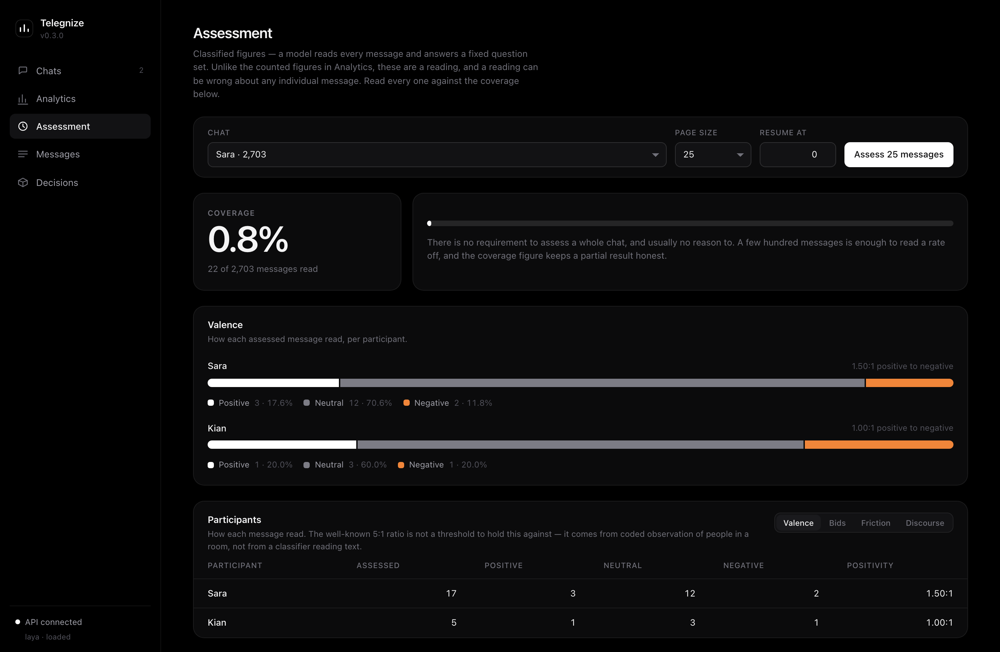

### Messages and decisions

A browser that lays Persian out right-to-left, and typed decisions with the
probability the engine assigned to every alternative.

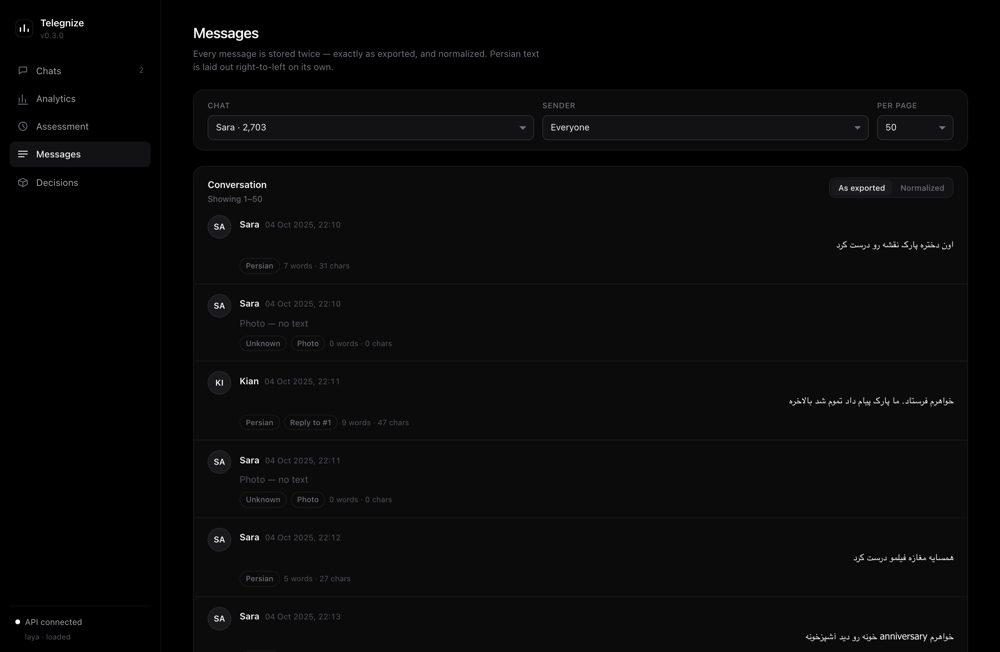

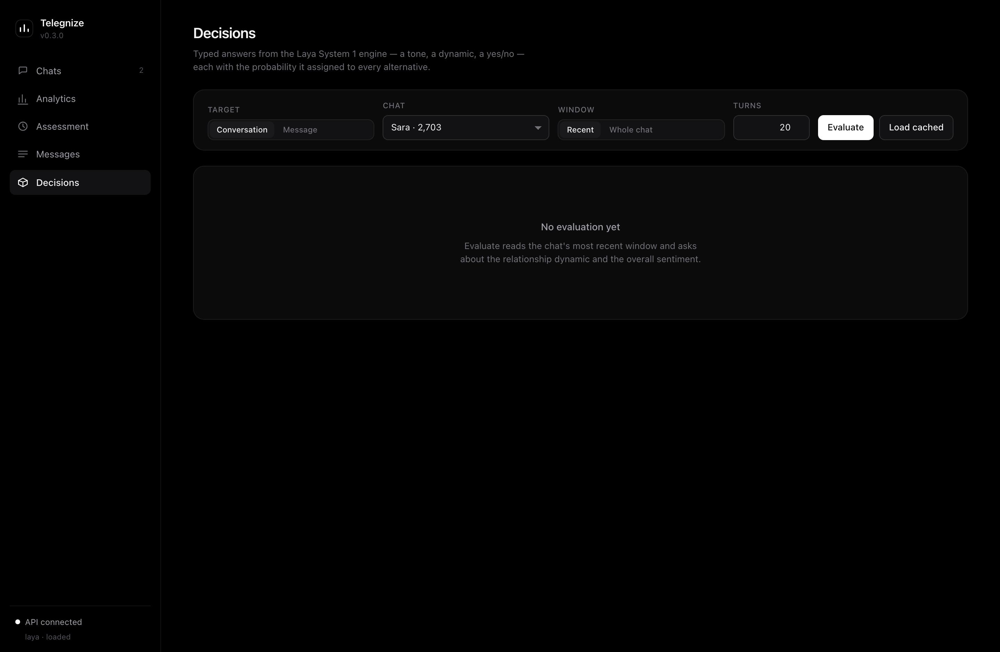

## Architecture

Three layers, with dependencies pointing inward:

```
domain/          entities, lexicons, repository interfaces   — no frameworks
application/     services, DTOs, outbound ports              — no adapters
infrastructure/  FastAPI, SQLite, ijson, hazm, Laya          — the outside world
frontend/        React + Vite UI                             — an API client
```

`application/ports/` holds the interfaces the services depend on — an export
reader, a text normalizer, a decision engine — and `infrastructure/` supplies
the implementations. `infrastructure/api/container.py` is the one place the two
halves are wired together.

See [docs/CONTRIBUTING.md](docs/CONTRIBUTING.md) for the design rules and
[docs/architecture.md](docs/architecture.md) for how a request flows through
the system.

## What Telegnize measures

**Counted** — exact arithmetic over timestamps and words. Per participant: what
hours they keep and how fast they answer while the conversation is live, who
opens and closes it and who revives it after days of nothing, how they hold the
floor (bursts, last word, messages that crossed in flight), what their
messages are made of (vocabulary, media, voice, links), and what their wording
carries — affection, apology, gratitude, absolutism, hedging, questions asked,
"we" against "I". Chat-wide: the rhythm of sittings and silences, how evenly
the conversation is shared, and how far the two participants' function-word use
converges.

**Classified** — a model's reading of each message, under
`/api/assessments`: emotional valence and the positive-to-negative ratio, bids
for connection and whether the reply engaged with them, friction by kind,
repair attempts, sarcasm, and open questions. This runs a model over every
message on CPU and is expensive — time a small page before starting a long run
— so it is paged and resumable, and every figure is reported against how much
of the chat it covers.

These are observations about a transcript, not measurements of a relationship.
[docs/analytics.md](docs/analytics.md) sets out what each figure means, what it
cannot tell you, and how to tune the thresholds behind it.

## Configuration

Every setting is an environment variable prefixed `TELEGNIZE_`:

| Variable | Default | Meaning |
| --- | --- | --- |
| `TELEGNIZE_DB_PATH` | `telegnize.sqlite` | SQLite file, or `:memory:` |
| `TELEGNIZE_HOST` | `127.0.0.1` | Bind address |
| `TELEGNIZE_PORT` | `8000` | Bind port |
| `TELEGNIZE_LOG_LEVEL` | `INFO` | Root log level |
| `TELEGNIZE_INGEST_BATCH_SIZE` | `500` | Messages per insert transaction |
| `TELEGNIZE_MAX_PAGE_SIZE` | `1000` | Ceiling on a list request |
| `TELEGNIZE_REPLY_WINDOW_SECONDS` | `86400` | Gap still counted as answering a reply |
| `TELEGNIZE_TURN_WINDOW_SECONDS` | `21600` | Gap still counted as answering a turn |
| `TELEGNIZE_SESSION_GAP_SECONDS` | `21600` | Silence that starts a new session |
| `TELEGNIZE_UPTAKE_WINDOW_SECONDS` | `3600` | How long a question stays live |
| `TELEGNIZE_ACTIVE_SESSION_SECONDS` | `7200` | Gap still counted as a reply inside a live conversation |
| `TELEGNIZE_LAST_WORD_GAP_SECONDS` | `10800` | Silence after which the message before it ended the conversation |
| `TELEGNIZE_SILENCE_SECONDS` | `172800` | Silence after which the conversation counts as stopped |
| `TELEGNIZE_COLLISION_SECONDS` | `30` | Gap inside which two messages count as written at once |
| `TELEGNIZE_BURST_FLOOR` | `3` | Messages in one turn before it counts as a burst |
| `TELEGNIZE_ASSESSMENT_PAGE_SIZE` | `25` | Messages assessed per call |
| `TELEGNIZE_CORS_ORIGINS` | `http://localhost:3000,http://127.0.0.1:3000` | Comma-separated browser origins — the default is where `frontend/` dev-serves |
| `TELEGNIZE_PRELOAD_DECISION_ENGINE` | `0` | `1` loads model weights at startup |
| `TELEGNIZE_RESIDENT_CHECKPOINTS` | `2` | Checkpoints held in memory at once — below 2, a chat that mixes scripts rebuilds one per switch |
| `TELEGNIZE_DECISION_CACHE_ENTRIES` | `10000` | Engine answers memoised, so repeated text is read once; `0` disables |
| `TELEGNIZE_DECISION_BATCH_SIZE` | `32` | Most messages packed into one engine forward pass |
| `TELEGNIZE_DECISION_MODEL_PATH` | `checkpoints/laya-multilingual-telegnize` if present | Fine-tuned checkpoint that replaces the multilingual one; empty disables |
| `TELEGNIZE_CUSTOM_MODEL_FOR_ENGLISH` | `0` | `1` sends English text to the fine-tune too, instead of the faster stock English checkpoint |

## Tests

```bash
uv run python -m unittest discover -s tests -t .
```

`tests/test_laya_engine.py` downloads and runs real model weights, so it is
skipped by default. Set `TELEGNIZE_SKIP_MODEL_TESTS=0` to run it deliberately:

```bash
TELEGNIZE_SKIP_MODEL_TESTS=0 uv run python -m unittest discover -s tests -t .
```

## License

Telegnize is free software under the [GNU General Public License v3.0](LICENSE)
or later.

You may use, study, change and redistribute it. If you distribute a modified
version, or run one as a network service people other than you can use, the
GPL requires that you offer them the corresponding source under the same
terms. There is no warranty, to the extent permitted by law.

## A closing note on what this is for

Telegnize describes a transcript. It counts what was written and when, and — if
you ask it to — reports what a classifier read in the text. It does not
measure a relationship, and the figures it produces are not evidence about a
person.

Chat logs are among the most private things people have, and a second person's
messages are in every export. Read [docs/analytics.md](docs/analytics.md)
before drawing a conclusion from anything here; it sets out, figure by figure,
what each one cannot tell you.
