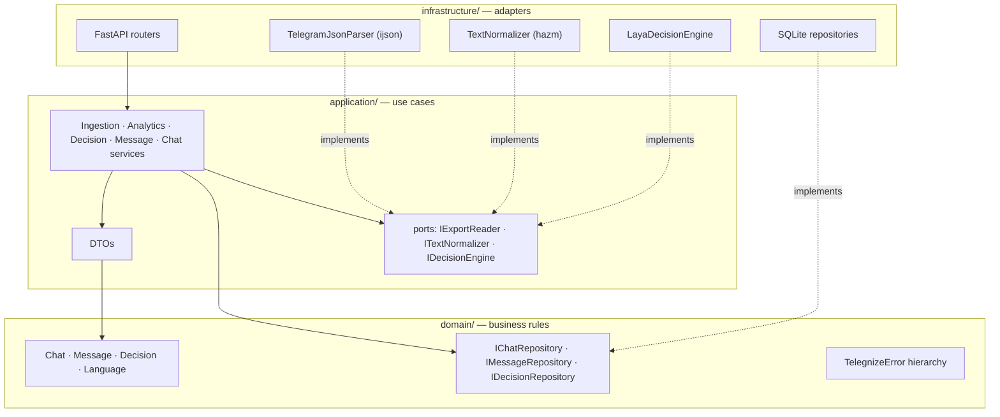
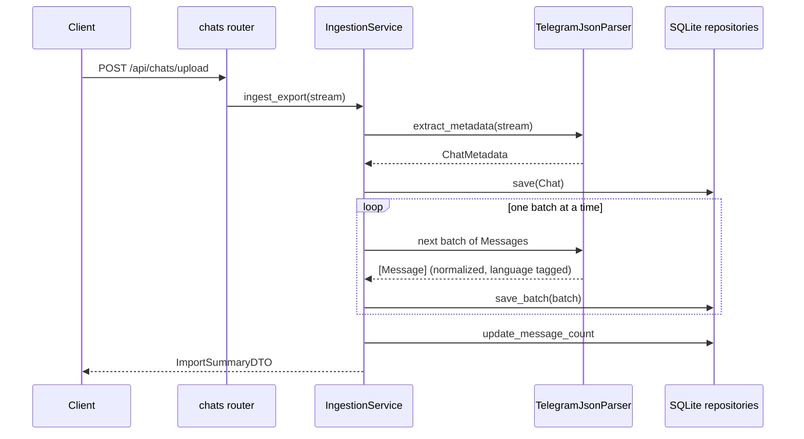

# Architecture

Telegnize is a layered application. Dependencies point inward: `infrastructure`
knows about `application` and `domain`, `application` knows about `domain`, and
`domain` knows about nothing but the standard library.

## Importing an export

The whole document is never in memory: `ijson` yields one message at a time and
the parser groups them into batches of `TELEGNIZE_INGEST_BATCH_SIZE`.

## Where each decision lives

**Derived values are computed once, at write time.** `word_count`,
`char_count`, `is_question`, and `is_cold_closure` are properties on the
`Message` entity — one definition — and are written into columns as messages are
stored. Analytics then reads them with `SUM(...)` instead of loading rows into
Python, so the cost of analysing a chat does not grow with its size.

**Response latency is SQL.** A message that replies to a message still in the
chat is timed against that parent; otherwise it is timed against whatever came
directly before it. A `LAG()` window function and a self-join express both
cases in one query, with the two time windows passed as parameters rather than
buried as literals.

**One `Database`, many repositories.** `infrastructure/persistence/database.py`
owns the connection policy — WAL, foreign keys, busy timeout — and applies the
schema once. Repositories borrow a connection per operation, which makes them
safe to share across FastAPI's worker threads and lets an in-memory database be
shared by every repository in a test.

**Ports keep the model swappable.** `application/ports/` defines what the
services need; `infrastructure/` supplies it. `DecisionService` works against
`IDecisionEngine`, which is why the test suite can exercise the whole decision
flow against a fake in milliseconds and still keep one integration test against
real weights.

**Errors are domain objects.** Services raise `ChatNotFoundError`,
`MessageNotFoundError`, `InvalidExportError`, `DecisionEngineError`; the
translation to HTTP status codes happens once, in
`infrastructure/api/app.py`. No service imports FastAPI.

## Typed decisions

A question is a `DecisionQuestion`: a key, a type (`choice`, `score`, `noul`),
instructions, and the criteria or levels that define its answer space. The Laya
adapter is the only code that knows Laya's wire format — it renders questions
into Laya's schema and decodes answers back into `EngineAnswer`, including
turning Laya's `noul` probability into the boolean the caller asked for while
keeping the probability alongside it.

Answers are cached in the `decisions` table keyed by (target, question), so
re-asking is free and changing one question does not invalidate the others.
