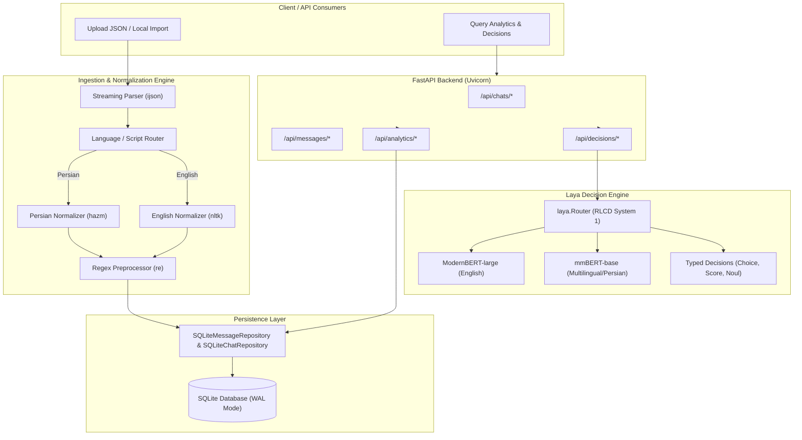

# Architecture & Implementation Plan: Telegnize - Telegram Chat Analyzer Intelligence

## Goal Description
Telegnize is an intelligent Telegram chat export analyzer. It enables users to ingest large Telegram chat exports, normalize multilingual texts (Persian using `hazm`, English using `nltk`), persist structured chat data in `sqlite3`, compute deep behavioral/statistical analytics, and perform high-speed typed decision making using the newly released **Laya** System 1 decision engine (supporting 100+ languages via its automatic router). The system exposes these capabilities through a clean REST API built with **FastAPI** and served with **uvicorn**.



---

## User Review Required

> [!IMPORTANT]
> **Laya Model Execution & Latency**: Laya runs non-autoregressive forward passes in ~33ms, but the underlying PyTorch checkpoints (`convaiinnovations/laya`) are ~800MB. The English checkpoint has been successfully verified on your system. During chat upload, messages are ingested and normalized asynchronously or in batches so ingestion remains instantaneous, while Laya decisions can be generated on-demand or as a background task.

> [!NOTE]
> **Database Schema Evolution**: We will upgrade the SQLite schema to support multi-chat isolation (`chats` table + `chat_id` foreign keys in `messages`), storing both `raw_text` and `normalized_text`, detected `language`, and a dedicated `laya_decisions` table to cache inference results.

---

## Proposed Changes

Grouped logically from domain entities up to application services and API routes.

```
Telegnize/
├── domain/
│   ├── models/
│   │   ├── chat.py             [NEW]
│   │   ├── message.py          [MODIFY]
│   │   ├── analysis.py         [NEW]
│   │   └── dict/lexicons.py    [MODIFY]
│   └── repository/
│       ├── chat_repository.py   [NEW]
│       └── message_repository.py[MODIFY]
├── infrastructure/
│   ├── nlp/
│   │   ├── __init__.py         [NEW]
│   │   └── normalizer.py       [NEW]
│   ├── parser/
│   │   ├── __init__.py
│   │   └── telegram_parser.py  [MODIFY]
│   ├── presistence/
│   │   └── schema.sql          [MODIFY]
│   ├── repository/
│   │   ├── sqlite_chat_repository.py    [NEW]
│   │   └── sqlite_message_repository.py [MODIFY]
│   ├── decision_engine/
│   │   ├── __init__.py         [NEW]
│   │   ├── laya_engine.py      [NEW]
│   │   └── schemas.py          [NEW]
│   └── api/
│       ├── controllers.py      [MODIFY]
│       ├── routers/
│       │   ├── chats.py        [NEW]
│       │   ├── messages.py     [NEW]
│       │   └── analytics.py    [NEW]
│       └── dependencies.py     [NEW]
├── application/
│   ├── dtos/
│   │   ├── chat_dto.py         [NEW]
│   │   ├── message_dto.py      [MODIFY]
│   │   └── analysis_dto.py     [NEW]
│   └── services/
│       ├── ingestion_service.py[NEW]
│       ├── analytics_service.py[NEW]
│       └── decision_service.py [NEW]
├── main.py                     [MODIFY]
└── tests/
    ├── test_normalizer.py      [NEW]
    ├── test_streaming_parser.py[NEW]
    ├── test_laya_engine.py     [NEW]
    ├── test_analytics.py       [NEW]
    └── test_api_controllers.py [MODIFY]
```

---

### Domain Layer

#### [NEW] `domain/models/chat.py`
Defines the `Chat` domain model representing a Telegram chat session:
- `id`: internal integer ID
- `telegram_chat_id`: exported ID (e.g. `555000111` from `example.json`)
- `name`: chat name / contact name (e.g. `"Dana"`)
- `type`: chat type (e.g. `"personal_chat"`, `"supergroup"`)
- `total_messages`: integer
- `created_at`: ingestion timestamp
- `participants`: set of participant names/IDs

#### [MODIFY] `domain/models/message.py`
Enhance `Message` with:
- `chat_id`: int
- `raw_text`: str
- `normalized_text`: str
- `language`: str (`'fa'`, `'en'`, `'mixed'`, `'unknown'`)
- Properties:
  - `is_question`: handles both English `?` and Persian `؟`
  - `is_natural_text`: non-forwarded, non-empty text
  - `word_count`, `char_count`
  - `is_cold_closure`: matches Persian & English low investment tokens

#### [NEW] `domain/models/analysis.py`
Domain structures for analytics:
- `ChatBehaviorStats`: message volume per user, word count distribution, average response latency in seconds, questions asked ratio, active hours heatmap (0-23), active weekdays (0-6).
- `LayaDecision`: typed result containing question key, decision type (`choice`, `score`, `noul`), selected choice or score, calibrated confidence, probabilities dictionary, and routing metadata.

#### [NEW] `domain/repository/chat_repository.py`
Interface `IChatRepository`:
- `create_or_update(chat: Chat) -> Chat`
- `get_by_id(chat_id: int) -> Optional[Chat]`
- `get_by_telegram_id(telegram_chat_id: int) -> Optional[Chat]`
- `list_all() -> List[Chat]`
- `delete(chat_id: int) -> bool`

#### [MODIFY] `domain/repository/message_repository.py`
Expand `IMessageRepository`:
- `save_batch_streaming(messages: Iterable[Message]) -> int`
- `get_by_chat(chat_id: int, limit: int, offset: int, sender_id: Optional[str]) -> List[Message]`
- `count_by_chat(chat_id: int) -> int`
- `get_chat_participants(chat_id: int) -> List[Dict[str, Any]]`
- `get_activity_by_hour(chat_id: int) -> Dict[int, int]`
- `get_timeline_messages(chat_id: int) -> List[Message]`

---

### NLP & Normalization Component

#### [NEW] `infrastructure/nlp/normalizer.py`
Implements multilingual text normalization combining `hazm`, `nltk`, and `re`:
- **Script/Language Detection**:
  - Checks character ratios using Unicode ranges (`\u0600-\u06FF` for Persian/Arabic, `a-zA-Z` for Latin).
  - Classifies into `"fa"`, `"en"`, `"mixed"`, or `"other"`.
- **Persian Processing (`hazm`)**:
  - Initializes `hazm.Normalizer()`.
  - Normalizes half-spaces (ZWNJ), harmonizes Arabic kaf/yeh (`ك`, `ي`) to Persian (`ک`, `ی`), trims repeated characters (e.g. "سللللام" -> "سلام").
- **English Processing (`nltk`)**:
  - Case folding (lowercasing).
  - Punctuation harmonization.
  - Sentence and token segmentation.
- **Regex Cleaning (`re`)**:
  - Strips zero-width artifacts, cleans URL links if desired (or replaces with placeholder tokens), collapses multiple consecutive whitespace / newlines.
- **Linguistic Metrics**:
  - Word count using regex `\w+` supporting Persian word boundaries.
  - Question detection: checks for `?` and Persian `؟`.

---

### Streaming Ingestion Component (`ijson`)

#### [MODIFY] `infrastructure/parser/telegram_parser.py`
Refactor parser to support both in-memory dicts and streaming with `ijson`:
- `stream_export_file(file_obj_or_path, batch_size=500)`:
  - Uses `ijson.items(f, 'messages.item')` to stream messages without holding the entire JSON array in memory.
  - Parses top-level metadata (`name`, `type`, `id`) with `ijson.parse(f)` or prefix queries.
  - Passes each raw message to `TelegramNormalizer` to produce domain `Message` entities.
  - Yields batches of `Message` entities ready for bulk insertion.
- Preserves backwards-compatible `parse_dict` and `parse_json` for existing tests.

---

### Persistence Layer (`sqlite3`)

#### [MODIFY] `infrastructure/presistence/schema.sql`
Update SQLite schema:
```sql
CREATE TABLE IF NOT EXISTS chats (
    id INTEGER PRIMARY KEY AUTOINCREMENT,
    telegram_chat_id INTEGER UNIQUE NOT NULL,
    name TEXT NOT NULL,
    type TEXT NOT NULL,
    total_messages INTEGER DEFAULT 0,
    created_at DATETIME DEFAULT CURRENT_TIMESTAMP
);

CREATE TABLE IF NOT EXISTS messages (
    id INTEGER PRIMARY KEY AUTOINCREMENT,
    chat_id INTEGER NOT NULL,
    telegram_msg_id INTEGER NOT NULL,
    sender_id TEXT NOT NULL,
    sender_name TEXT NOT NULL,
    timestamp DATETIME NOT NULL,
    raw_text TEXT,
    normalized_text TEXT,
    language TEXT DEFAULT 'unknown',
    content_type TEXT NOT NULL DEFAULT 'text',
    reply_to_msg_id INTEGER,
    is_forwarded BOOLEAN DEFAULT 0,
    word_count INTEGER DEFAULT 0,
    char_count INTEGER DEFAULT 0,
    FOREIGN KEY(chat_id) REFERENCES chats(id) ON DELETE CASCADE,
    UNIQUE(chat_id, telegram_msg_id)
);

CREATE INDEX IF NOT EXISTS idx_messages_chat_ts ON messages(chat_id, timestamp);
CREATE INDEX IF NOT EXISTS idx_messages_chat_sender ON messages(chat_id, sender_id);
CREATE INDEX IF NOT EXISTS idx_messages_reply ON messages(chat_id, reply_to_msg_id);

CREATE TABLE IF NOT EXISTS laya_decisions (
    id INTEGER PRIMARY KEY AUTOINCREMENT,
    target_type TEXT NOT NULL, -- 'message' or 'chat'
    target_id INTEGER NOT NULL,
    question_key TEXT NOT NULL,
    decision_type TEXT NOT NULL, -- 'choice', 'score', 'noul'
    result_value TEXT NOT NULL,
    confidence REAL,
    probabilities TEXT, -- JSON string
    created_at DATETIME DEFAULT CURRENT_TIMESTAMP,
    UNIQUE(target_type, target_id, question_key)
);
```

#### [NEW] `infrastructure/repository/sqlite_chat_repository.py`
Implements `IChatRepository` with standard CRUD and connection handling.

#### [MODIFY] `infrastructure/repository/sqlite_message_repository.py`
- Implements batch insertion with `executemany` inside a single transaction for high performance.
- Adds analytical queries:
  - Message counts and word counts grouped by `sender_id`
  - Hourly distribution (`strftime('%H', timestamp)`)
  - Reply response latency calculation (comparing timestamp of `reply_to_msg_id` with reply timestamp)
  - Question ratio calculation.

---

### Laya Decision Engine Component

#### [NEW] `infrastructure/decision_engine/schemas.py`
Pre-defined typed decision question sets for Telegram conversations:
- **Message Tone**:
  ```python
  TONE_QUESTIONS = {
      "tone": {
          "type": "choice",
          "instructions": "What is the emotional tone of this message?",
          "criteria": {
              "affectionate": "warm, loving, caring, friendly",
              "casual": "everyday, relaxed, informal",
              "urgent": "requires immediate attention, anxious",
              "frustrated": "annoyed, angry, expressing complaint",
              "neutral": "factual, simple statement without emotion"
          }
      },
      "is_conflict": {
          "type": "noul",
          "instructions": "Does this message express tension, argument, or conflict?"
      }
  }
  ```
- **Relationship Dynamic (Chat-Level Window)**:
  ```python
  RELATIONSHIP_QUESTIONS = {
      "relationship_type": {
          "type": "choice",
          "instructions": "What describes the dynamic between the participants?",
          "criteria": {
              "close_friends": "frequent banter, casual, friendly",
              "romantic": "affectionate, intimate personal sharing",
              "work_colleagues": "task-oriented, professional discussion",
              "acquaintances": "polite, distant, formal exchanges"
          }
      },
      "sentiment": {
          "type": "choice",
          "instructions": "What is the overall sentiment of this exchange?",
          "criteria": {
              "positive": "harmonious, supportive, happy",
              "neutral": "standard communicative, informative",
              "tense": "strained, conflicting, cold"
          }
      }
  }
  ```

#### [NEW] `infrastructure/decision_engine/laya_engine.py`
Wraps `laya.Router`:
- Singleton or shared instance of `laya.Router(preload=False)` to save memory until requested.
- Automatic routing:
  - English requests -> ModernBERT-large checkpoint (`convaiinnovations/laya`)
  - Persian/Arabic text -> Multilingual checkpoint (`mmBERT-base`)
- Exposes:
  - `evaluate_message(text: str, questions: Optional[dict]) -> dict`
  - `evaluate_conversation_window(messages: List[str], questions: Optional[dict]) -> dict`
  - `evaluate_custom(state: Any, questions: dict) -> dict`

---

### Application Services Layer

#### [NEW] `application/services/ingestion_service.py`
- Handles streaming file ingestion via `ijson`.
- Runs batching (e.g. 500 messages per chunk), sends to `normalizer`, inserts into SQLite in transactions.
- Computes and updates chat-level aggregate counts.

#### [NEW] `application/services/analytics_service.py`
- Computes comprehensive analytics:
  - **Volume & Balance**: Participant message shares, word counts, average length.
  - **Engagement & Latency**: Average response time per participant, median response time, longest reply gap.
  - **Linguistic Markers**: Questions asked per participant, exclamation count, cold closure rate (e.g. "ok", "باشه", "مرسی").
  - **Temporal Patterns**: Peak active hours (0-23), busiest days of week (Mon-Sun).

#### [NEW] `application/services/decision_service.py`
- Coordinates Laya decision execution:
  - Run message-level decision on a selected message or key messages.
  - Run dialogue-level decision on sample dialogue turns.
  - Persist decisions in `laya_decisions` table to avoid redundant inferences.
  - Execute on-demand custom typed questions.

---

### REST API Layer (FastAPI)

#### [MODIFY] `main.py` & `infrastructure/api/controllers.py`
Organize routes into clean APIRouters:
- `POST /api/chats/upload`: Upload file with `ijson` streaming.
- `POST /api/chats/import-local`: Import from local path (e.g. `example.json`).
- `GET /api/chats`: List all imported chats with overview stats.
- `GET /api/chats/{chat_id}`: Detailed chat view.
- `GET /api/chats/{chat_id}/messages`: Query messages (pagination, sender filter).
- `GET /api/chats/{chat_id}/analytics`: Statistical & behavioral chat insights.
- `POST /api/chats/{chat_id}/decisions`: Run Laya decisions on conversation window.
- `POST /api/messages/{message_id}/decisions`: Run Laya decision on a single message.
- `POST /api/decisions/custom`: Run arbitrary Laya typed questions.
- `GET /api/health`: Health status and model readiness.

---

## Verification Plan

### Automated Tests
1. **NLP Normalization Tests (`tests/test_normalizer.py`)**:
   - Persian text normalization with Hazm (half-space ZWNJ, character harmonization, question marks `؟`).
   - English text normalization with NLTK (lowercasing, tokenization, question marks `?`).
   - Mixed script detection.
2. **Streaming Parser Tests (`tests/test_streaming_parser.py`)**:
   - Verify `ijson` streams without loading full file into memory.
   - Verify parsing of formatted text, media messages, replies, forwarded status.
3. **Repository Tests (`tests/test_sqlite_message_repository.py`)**:
   - Test chat creation, batch upsert of messages, foreign keys, index performance.
   - Test analytical queries (hourly distribution, latency calculation).
4. **Laya Decision Engine Tests (`tests/test_laya_engine.py`)**:
   - Test typed decision outputs (`choice`, `score`, `noul`).
   - Test router script detection (Latin -> English checkpoint, Persian -> Multilingual checkpoint).
5. **API Controller Tests (`tests/test_api_controllers.py`)**:
   - Test file upload, local import of `example.json`.
   - Test analytics retrieval endpoint.
   - Test Laya decision endpoints.

Run all tests via:
```bash
uv run python -m unittest discover tests
```

### Manual Verification
1. Start the FastAPI server:
   ```bash
   uv run uvicorn main:app --reload --port 8000
   ```
2. Ingest `example.json`:
   ```bash
   curl -X POST http://localhost:8000/api/chats/import-local -H "Content-Type: application/json" -d '{"file_path": "example.json"}'
   ```
3. Fetch analytical overview:
   ```bash
   curl http://localhost:8000/api/chats/1/analytics
   ```
4. Request Laya decisions on chat interaction:
   ```bash
   curl -X POST http://localhost:8000/api/chats/1/decisions
   ```
5. Verify OpenAPI Swagger UI at `http://localhost:8000/docs`.
