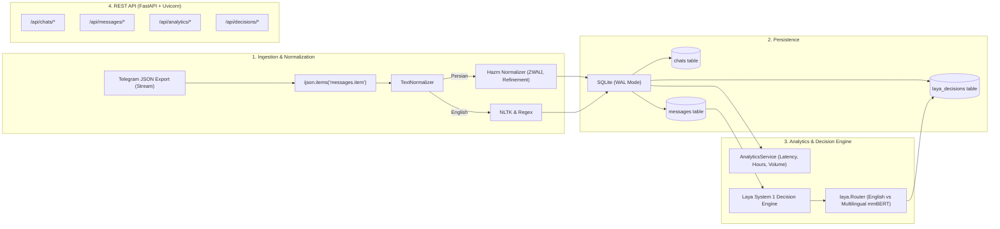

# Telegnize: Telegram Chat Analyzer Intelligence - Walkthrough

We have transformed **Telegnize** into an intelligent Telegram chat export analyzer powered by **FastAPI**, **uvicorn**, **ijson** streaming, **hazm** and **nltk** text normalizers, **sqlite3** persistence, and the **Laya** System 1 non-autoregressive decision engine.

---

## 1. Architecture & Component Summary



---

## 2. Key Changes Implemented

### Storing & Ingestion
- **Streaming Parser with `ijson`** ([`TelegramJsonParser`](file:///Users/farnam/Developer/Telegnize/infrastructure/parser/telegram_parser.py)):
  - Streams messages in batches (`stream_messages`) without loading multi-megabyte/gigabyte JSON exports into RAM.
  - Extracts chat metadata (`extract_chat_metadata`) directly from file stream.
- **Multilingual NLP Engine** ([`TextNormalizer`](file:///Users/farnam/Developer/Telegnize/infrastructure/nlp/normalizer.py)):
  - Detects script & language (`fa`, `en`, `mixed`, `other`).
  - Persian: applies `hazm.Normalizer()` for half-spaces (ZWNJ), Arabic Yeh/Kaf harmonization, and repeated character compression.
  - English: applies lowercase normalization, URL/whitespace regex cleanup.
  - Multilingual question detection (`?` and `؟`).
- **SQLite Database** ([`schema.sql`](file:///Users/farnam/Developer/Telegnize/infrastructure/presistence/schema.sql)):
  - Multi-chat isolation (`chats` table + `chat_id` foreign key on `messages`).
  - Stores both `raw_text` and `normalized_text` along with detected `language`.
  - Dedicated `laya_decisions` table to cache inference results.
  - Automated schema migration support in [`SQLiteMessageRepository`](file:///Users/farnam/Developer/Telegnize/infrastructure/repository/sqlite_message_repository.py).

### Laya System 1 Decision Engine
- **Decision Engine Wrapper** ([`LayaDecisionEngine`](file:///Users/farnam/Developer/Telegnize/infrastructure/decision_engine/laya_engine.py)):
  - Uses `laya.Router` for automatic language routing (~33ms inference): ModernBERT for English, mmBERT for Persian/multilingual.
  - Pre-calibrated question schemas ([`schemas.py`](file:///Users/farnam/Developer/Telegnize/infrastructure/decision_engine/schemas.py)):
    - Message tone: `tone` (choice: `affectionate`, `friendly`, `casual`, `frustrated`, `neutral`), `is_conflict` (noul/boolean).
    - Dialogue dynamic: `relationship_dynamic` (choice: `close_friends`, `romantic`, `colleagues`, `acquaintances`), `overall_sentiment` (choice: `positive`, `neutral`, `tense`).
  - Ad-hoc custom query evaluation (`POST /api/decisions/custom`).

### REST API Endpoints ([FastAPI + Uvicorn](file:///Users/farnam/Developer/Telegnize/infrastructure/api/controllers.py))
- `POST /api/chats/upload`: Stream-upload JSON export file via `ijson`.
- `POST /api/chats/import-local`: Stream-ingest a local file export (e.g. `example.json`).
- `GET /api/chats`: List all imported chats with overview stats.
- `GET /api/chats/{chat_id}`: Retrieve chat metadata.
- `GET /api/chats/{chat_id}/messages`: Paginated messages with sender filter.
- `GET /api/analytics/{chat_id}`: Behavioral stats, active hours, response latency, and question counts.
- `POST /api/decisions/messages/{message_id}`: Run Laya decision on a message.
- `POST /api/decisions/chats/{chat_id}`: Run Laya decision on conversation window.
- `POST /api/decisions/custom`: Run arbitrary typed question against any state.
- `GET /`: Health check and system capability overview.

---

## 3. Verification & Validation Results

### Automated Unit Test Suite
Ran full test suite using `uv run python -m unittest discover tests`:
```
..........................
Ran 29 tests in 33.299s
OK
```
All 29 tests across normalizers, streaming parser, SQLite repositories, Laya decision engine, and API controllers passed with 0 failures.

### Real Export Benchmark (`example.json`)
Tested streaming ingestion on the 49,700-line `example.json`:
- **Ingestion Time**: **~1 second** for **3,113 messages**
- **Participants**:
  - `Farnam`: 1,923 messages, 9,593 words, 32 questions, avg response latency **164.51s**
  - `Dana`: 1,190 messages, 6,497 words, 152 questions, avg response latency **453.00s**
- **Language Detection**:
  - Persian (`fa`): 2,845 messages
  - English (`en`): 39 messages
  - Mixed: 17 messages
  - Other (media/stickers): 109 messages
- **Overall Average Response Latency**: **304.72s** (~5 minutes)

---

## 4. How to Run the Server

To start the Telegnize API with Uvicorn:
```bash
uv run uvicorn main:app --reload --port 8000
```
Interactive OpenAPI documentation is available at:
`http://localhost:8000/docs`
